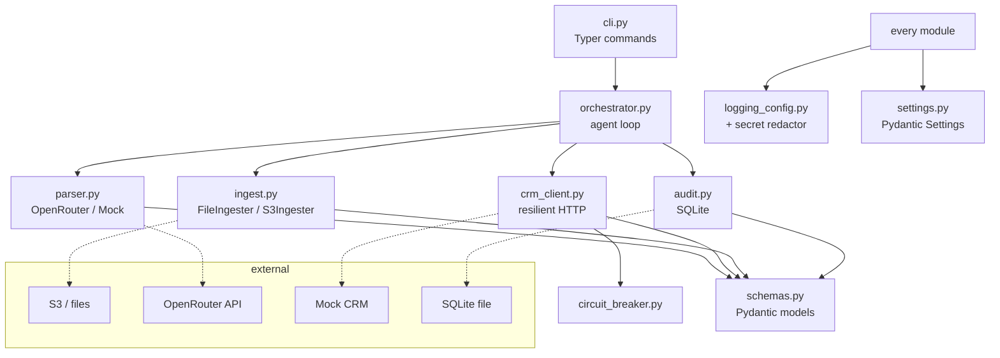
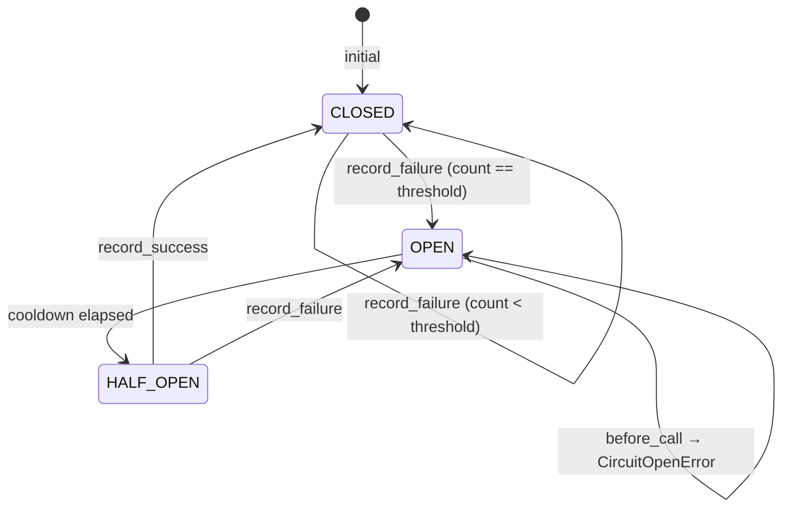

# Architecture

This document is the deep-dive companion to the [README](README.md). It maps the data flow, walks through every resilience layer, lists the failure modes the system handles (and the ones it doesn't), and explains the architectural trade-offs.

---

## 1. The end-to-end data flow

A customer record's journey from "S3" to the CRM, in full:

```mermaid
sequenceDiagram
    autonumber
    participant S3 as S3 (file fixtures)
    participant Ing as Ingester
    participant Orch as Orchestrator
    participant Audit as audit_log
    participant LLM as LLM Parser
    participant Schema as Pydantic schema
    participant Map as Mapper
    participant Cb as Circuit breaker
    participant Ten as Tenacity retry
    participant Http as httpx
    participant CRM as Legacy CRM
    participant DLQ as DLQ
    participant HR as human_review

    Orch->>Audit: start_run() → run_id
    Orch->>Ing: list_documents()
    Ing-->>Orch: RawDocument

    Orch->>Audit: log(step="ingested", status="in_progress")
    Orch->>LLM: parse(doc)
    LLM-->>Orch: ParsedCustomer (or ParseError)

    alt parse failed
        Orch->>Audit: log(step="parsed", status="parse_failed", detail={error})
        Orch-->>Orch: counter.parse_failed += 1; next doc
    else parsed
        Orch->>Audit: log(step="parsed", detail={confidence})
        alt confidence < 0.8
            Orch->>HR: route to human review
            Orch->>Audit: log(step="gated", status="human_review")
            Orch-->>Orch: counter.human_review += 1; next doc
        else confidence ≥ 0.8
            Orch->>Schema: ParsedCustomer.validate (strict)
            Orch->>Map: from_parsed(parsed)
            Map-->>Orch: CRMUpsertRequest{..., dedup_key=sha256(...)}
            Orch->>Audit: log(step="mapped", detail={dedup_key})

            Orch->>Cb: before_call()
            alt breaker open
                Cb-->>Orch: CircuitOpenError
                Orch->>DLQ: dlq_put(payload, last_error="breaker open")
                Orch->>Audit: log(step="pushed", status="dlq")
            else breaker closed/half-open
                loop tenacity (max_attempts)
                    Orch->>Ten: attempt
                    Ten->>Http: POST /v0/customer.upsert (Idempotency-Key=dedup_key)
                    Http->>CRM: HTTP request
                    alt 200/201
                        CRM-->>Http: success body
                        Http-->>Ten: response
                        Ten-->>Orch: success
                        Orch->>Cb: record_success()
                        Orch->>Audit: log(step="pushed", status="success")
                    else 429/5xx
                        CRM-->>Http: error
                        Http-->>Ten: CRMRetriableError
                        Note over Ten: backoff = exp(initial, max) + jitter
                    else 4xx (other)
                        CRM-->>Http: error
                        Http-->>Ten: CRMPermanentError → reraise
                        Orch->>HR: route to human review
                        Orch->>Audit: log(step="pushed", status="human_review")
                    end
                end
                alt all retries exhausted
                    Ten-->>Orch: CRMRetriableError (final)
                    Orch->>Cb: record_failure()
                    Orch->>DLQ: dlq_put(payload, last_error)
                    Orch->>Audit: log(step="pushed", status="dlq")
                end
            end
        end
    end

    Orch->>Audit: finalize_run(counters)
```

The crucial property: **every state transition writes to `audit_log` *before* the operation that follows it**. So a power-cut mid-record always leaves the database in a state where you can see exactly what was in flight. This is the standard *outbox* pattern — write the intent, then act, then write the result.

---

## 2. Module boundaries (the dependency graph)



The arrows are *dependencies*. The orchestrator depends on **Protocols** (`Ingester`, `Parser`) — concrete implementations like `FileIngester`, `OpenRouterParser`, `MockParser` plug in via the factory functions in `ingest.py` and `parser.py`. Swapping S3 for filesystem, or OpenAI for Anthropic, is a one-class change. No code outside those two files knows or cares.

---

## 3. The five resilience patterns, expanded

### 3.1 Idempotency keys

**Problem:** the orchestrator may push the same record twice — for example, if the run is interrupted and resumed, or if S3 has a duplicate object, or if the LLM emits the same `customer_id` for two near-identical inputs. The CRM must not double-insert.

**Solution:** every `CRMUpsertRequest` carries a `dedup_key = sha256(canonical_payload)` where the canonical payload is `customer_id|name|email|phone|company|address|notes`. The client sends this in two places:

1. The HTTP `Idempotency-Key` header — the CRM uses this to short-circuit replays.
2. The body — for the audit log.

The CRM's contract: a request whose `Idempotency-Key` it has seen returns `200 OK` with `status="duplicate"` and the *original* `crm_record_id`. No mutation happens. So replaying the entire run is safe.

**Why hash the canonical payload, not just `customer_id`?** Because if a customer's email changes, we *do* want a new dedup key, so the CRM treats it as a real update. If we used the customer_id alone, a corrected email would silently not propagate.

**Tested in:** `tests/test_schemas.py::TestCRMUpsertRequest::test_dedup_key_is_deterministic` and friends.

### 3.2 Exponential backoff with jitter

**Problem:** the legacy CRM rate-limits and 5xxs. Naive retry-immediately would hammer it. Synchronous retries with no jitter cause "thundering herd" when many clients all wait the same fixed delay.

**Solution:** [tenacity](https://tenacity.readthedocs.io/) `wait_exponential_jitter(initial, max, jitter)`. After failure `n`, wait `min(initial * 2^n, max) + uniform(0, jitter)` seconds. With our defaults (`initial=0.5s`, `max=8s`, `jitter=0.5s`) and 5 attempts, the worst-case wall time is about `0.5 + 1 + 2 + 4 + 8 = 15.5 seconds` of backoff per record, which is short enough to feel responsive in the demo but long enough to let a real CRM recover.

**Critical detail:** retries are scoped to `CRMRetriableError` (raised from 429 + 5xx + connection errors). 4xx-other-than-429 raises `CRMPermanentError` and bypasses retry — there's no point retrying a `422 unprocessable`. This separation is in `_RETRIABLE_STATUS = {429, 500, 502, 503, 504}` in `crm_client.py`.

**Tested in:** `tests/test_crm_client.py::TestCRMClient::test_retries_429_then_succeeds`, `test_retries_503_then_succeeds`, `test_4xx_other_than_429_is_permanent`, `test_connection_error_is_retriable`.

### 3.3 Circuit breaker

**Problem:** if the CRM is *actually* down for hours, retrying every record exhausts every client thread on the same broken downstream. We waste time, blow through rate limits trying to retry, and produce a useless run.

**Solution:** a hand-rolled three-state breaker in `circuit_breaker.py`. After `failure_threshold` consecutive failures, the breaker opens. Subsequent calls fast-fail with `CircuitOpenError` and never even open the socket — the orchestrator routes them to the DLQ.

After `reset_after_s` seconds the breaker transitions to `HALF_OPEN`. The next call is a *probe*: if it succeeds, the breaker closes (and the failure counter resets). If it fails, the breaker re-opens immediately and the cooldown restarts.

**State machine:**



**Why hand-rolled?** Twenty lines is twenty lines; pulling in `pybreaker` would add a dependency, an opinion, and a layer of indirection for negative reviewer benefit. The recruiter can read the state machine in one pass.

**Tested in:** `tests/test_circuit_breaker.py` covers all six transitions.

### 3.4 DLQ (dead-letter queue)

**Problem:** transient errors are retried; permanent errors are routed; but what about the record that fails *after* every retry, or hits a tripped breaker? Dropping it would silently lose data. Aborting the run would block the other 99 records.

**Solution:** a `dlq` table in SQLite. Every record that exhausts retries (or hits the breaker) gets inserted with:

```sql
CREATE TABLE dlq (
    id            INTEGER PRIMARY KEY AUTOINCREMENT,
    run_id        TEXT NOT NULL,
    source_id     TEXT NOT NULL,
    customer_id   TEXT,
    payload       TEXT NOT NULL,        -- JSON of CRMUpsertRequest
    last_error    TEXT NOT NULL,
    attempt_count INTEGER NOT NULL DEFAULT 0,
    created_at    TEXT NOT NULL,
    last_tried_at TEXT NOT NULL,
    next_retry_at TEXT,
    UNIQUE(run_id, source_id)
);
```

The `UNIQUE(run_id, source_id)` makes `dlq_put` an upsert — re-running with the same source bumps `attempt_count` instead of duplicating the row.

**Replay:** `agentic-onboard dlq replay` re-attempts every entry through the same `CRMClient` with the same idempotency keys. Records that succeed are popped from the DLQ; the rest stay (with their `attempt_count` incremented) for the next replay.

**Tested in:** `tests/test_audit.py::TestDLQ` and `tests/test_orchestrator.py::test_replay_dlq_succeeds_on_recovered_crm`.

### 3.5 Audit log

**Problem:** when the CRM team asks "what did your pipeline send us yesterday at 14:23?", the answer needs to be authoritative, not "checking my logs…".

**Solution:** `audit_log` table. Every step writes a row *before* the step runs. Schema:

```sql
CREATE TABLE audit_log (
    id          INTEGER PRIMARY KEY AUTOINCREMENT,
    run_id      TEXT NOT NULL,
    source_id   TEXT NOT NULL,
    customer_id TEXT,
    step        TEXT NOT NULL,    -- 'ingested' | 'parsed' | 'mapped' | 'pushed' | 'gated' | 'failed'
    status      TEXT NOT NULL,    -- RecordStatus value or 'in_progress'
    detail      TEXT,             -- JSON
    occurred_at TEXT NOT NULL
);
```

`agentic-onboard audit <run_id>` prints the full timeline for one run. Indexes on `run_id`, `source_id`, and `step` make the common queries fast.

**Tested in:** `tests/test_audit.py`.

---

## 4. The "agent loop" — why it's deliberately not a framework

The handoff doc was specific: don't reach for LangChain / LangGraph / CrewAI. Here's why that matters in practice.

The "AI agent" in this pipeline is exactly one decision: *given a raw document, produce a structured `Customer`*. Everything else — ingest, validation, mapping, retry, breaker, DLQ, audit — is deterministic plumbing that an "agent framework" would *obscure*, not enable.

What you'd lose by introducing LangGraph here:

- A `for doc in ingester` becomes a "graph definition" with nodes, edges, and a cryptic `state` dict.
- The error-routing decision tree (`ParseError → parse_failed`, `low confidence → human_review`, `CRMRetriableError → DLQ`, `CRMPermanentError → human_review`) becomes a callback hidden inside a `conditional_edge`.
- The audit log's "write before, then act" pattern becomes a custom `MemorySaver` subclass.
- The recruiter, reading the codebase, has to learn LangGraph's mental model before they can read your code.

What you'd gain: nothing this pipeline needs.

When *would* an agent framework earn its keep? When the LLM is making *sequential decisions with tool use* — calling `search_customer`, then `validate_address`, then `propose_merge` — and you need a graph to express the planning loop. That's not this. The LLM here is a single-call structured-output extractor. Plain Python is the right tool.

This is the FDSE judgment call the prompt is asking us to make.

---

## 5. Failure modes and how the system handles them

| Failure | Where it surfaces | What the system does |
|---|---|---|
| S3 object unreadable (binary, weird encoding) | `FileIngester.list_documents` | Skipped silently (`UnicodeDecodeError`). A real S3 backend would route to a separate raw-blob queue. |
| LLM emits invalid JSON / wrong schema | `parser.py` Pydantic `ValidationError` | Caught, raised as `ParseError`, recorded as `parse_failed`. Run continues. |
| LLM extraction is technically valid but uncertain | `confidence < 0.8` check in orchestrator | Record routes to `human_review`, never hits the CRM. |
| LLM provider 5xx or rate-limited | `OpenRouterParser.parse` | Currently raises `ParseError` (no retry on the LLM call). Trade-off: keep the LLM call simple; orchestrator's parse_failed path handles it. A future improvement: wrap the LLM call in tenacity too. |
| CRM 429 / 5xx (transient) | `crm_client._do_upsert` raises `CRMRetriableError` | Tenacity retries with exp+jitter; on success, life goes on; on exhaustion, DLQ. |
| CRM 4xx other than 429 (permanent) | `crm_client._do_upsert` raises `CRMPermanentError` | Skipped retry, routed to `human_review`, breaker *not* tripped. |
| CRM connection refused / DNS / timeout | `httpx.HTTPError` caught by `_do_upsert` | Treated as transient; retried. |
| Many CRM failures in a row | Circuit breaker trips after threshold | Subsequent records fast-fail to DLQ until cooldown elapses. |
| Process crashes mid-run | OS kill, hardware failure | Audit log has every step's pre-write. Re-running the same `samples/` directory is safe — idempotency keys make every successful upsert a no-op replay. |
| CRM accepts the request but loses the response | Network partition after the CRM has mutated | Retry with the same idempotency key; CRM returns `status="duplicate"` and the original `crm_record_id`. No double-insert. |
| OpenRouter quota exhausted mid-run | `OpenRouterParser.parse` raises | Each affected record is `parse_failed`; switching to `LLM_PROVIDER=mock` keeps the run going. |
| Disk full mid-audit-write | `sqlite3.OperationalError` | Run aborts cleanly; the `with audit:` cleanup logic in the CLI ensures no half-open file handles. Existing audit data is intact (WAL mode). |

---

## 6. Threat model (security)

The repo is public on GitHub and ships with real-credential code paths. The threat model assumes:

- **GitHub crawlers + bots** scraping public repos for committed secrets.
- **Recruiters** running `git clone && make run` on their laptop.
- **Curious developers** poking at the audit DB.
- **Compromised dev laptop** (some attacker who got file-system access).
- **Future me** copying-pasting code without thinking.

Defenses, layered:

1. **`.gitignore`** blocks `.env`, `*.key`, `*.pem`, `secrets/`. Only `.env.example` (placeholders) is in repo.
2. **Pydantic `SecretStr`** wraps the API key in memory; printing the settings prints `SecretStr('**********')`.
3. **structlog redaction processor** strips OpenAI/OpenRouter/Anthropic/Bearer/JWT-shaped strings from every log event before rendering. Tested against six formats. Even if a stack trace catches a key string, it never lands on disk.
4. **Stdlib `logging` is bridged through the same redactor** so httpx/uvicorn logs are also scrubbed.
5. **Pre-commit hook** runs `gitleaks` so a leak is caught locally before `git push`.
6. **GitHub Push Protection** is on by default for public repos; if local protection fails, GitHub's would catch a sk-or-v… push.
7. **GitHub Actions Security workflow** runs `gitleaks-action` + `CodeQL` on every PR + weekly cron.
8. **CI runs against the mock LLM** (`LLM_PROVIDER=mock`) — `OPENROUTER_API_KEY` never enters Actions.
9. **Docker image** does not `COPY .env`. Secrets are mounted at runtime via `docker-compose` env vars.
10. **Audit DB is gitignored** (`*.db`). It contains parsed customer data.

Out of scope for this 6-hour project:

- Hardware security modules / KMS.
- mTLS to the legacy CRM.
- Audit log signing / tamper-evidence (would use append-only SQLite + hashes).
- Customer PII redaction (the audit log stores the parsed customer record verbatim; a real deployment would tokenize fields before persisting).

---

## 7. Performance characteristics

A single demo run (8 documents, mock LLM, mock CRM with 15% fault injection):

| Stage | Wall time | Notes |
|---|---|---|
| Ingest 8 files | ~5 ms | Local filesystem, sequential read |
| Parse 8 documents (mock) | ~10 ms | Pure regex |
| Parse 8 documents (gpt-4o-mini) | ~3-6 s | Network-bound, single-threaded |
| Push 8 records (with fault retries) | ~500-700 ms | Includes ~1-2 retries on average |
| Audit + DLQ writes | ~30 ms | SQLite WAL, one row per step ≈ 40 rows |
| **Total (mock LLM)** | **~600 ms** | |
| **Total (gpt-4o-mini)** | **~5-7 s** | |

Throughput would be N× higher with `asyncio.gather` over the LLM and CRM calls; the demo keeps it sequential for readability. The change is local — the orchestrator's `_handle_one` becomes `async def` and the for-loop becomes an async-gather. No structural rework.

---

## 8. What's deliberately out of scope

Listed honestly because honest scoping is what makes a senior engineer believable.

- **Real S3.** The `Ingester` Protocol is implemented over the local filesystem; an `S3Ingester` stub in `ingest.py` documents the boto3 swap (one class, ~10 lines). Decision-by-design (the user said "local fixtures only").
- **Production-grade observability.** Logs are structured (structlog) and audit data is in SQLite; a real deployment would ship logs to OpenTelemetry → SIEM and audit data to Postgres. Both are one-class changes.
- **Multi-tenant rate limiting.** The breaker is per-process. A real deployment would share state via Redis (or use the platform's own limiter).
- **LLM cost tracking + budget cap.** OpenRouter's dashboard handles this for the demo's volume (~$0.0001 per document). A real deployment would emit cost metrics per run.
- **Human-review UI.** The "human review" queue is a status in the audit log; a UI is out of scope.
- **Multiple LLM providers in flight.** The factory is a hard branch. A real deployment would have a router that prefers OpenAI for some doc formats and Anthropic for others, or falls through on quota exhaustion. Trivial to add.

---

## 9. References

- *Release It! Design and Deploy Production-Ready Software* — Michael T. Nygard. Where I learned the circuit-breaker pattern.
- [Tenacity docs](https://tenacity.readthedocs.io/) — exponential backoff, jitter, retry policies.
- [Stripe API: Idempotent Requests](https://stripe.com/docs/api/idempotent_requests) — the canonical reference for idempotency keys.
- [Outbox pattern](https://microservices.io/patterns/data/transactional-outbox.html) — write-before-act, the audit log's design rationale.
- [OpenAI structured outputs](https://platform.openai.com/docs/guides/structured-outputs) — the schema-coercion mechanism the LLM parser uses.
- [Pydantic Settings](https://docs.pydantic.dev/latest/concepts/pydantic_settings/) — single-source-of-truth config.
- [structlog](https://www.structlog.org/) — structured logging, the substrate for the secret redactor.
