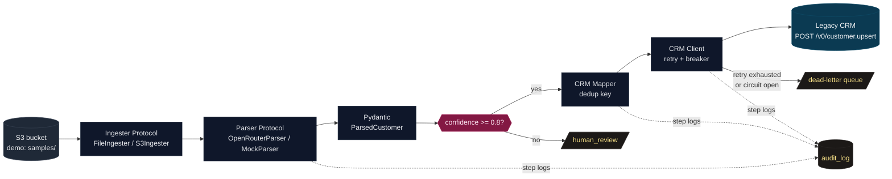
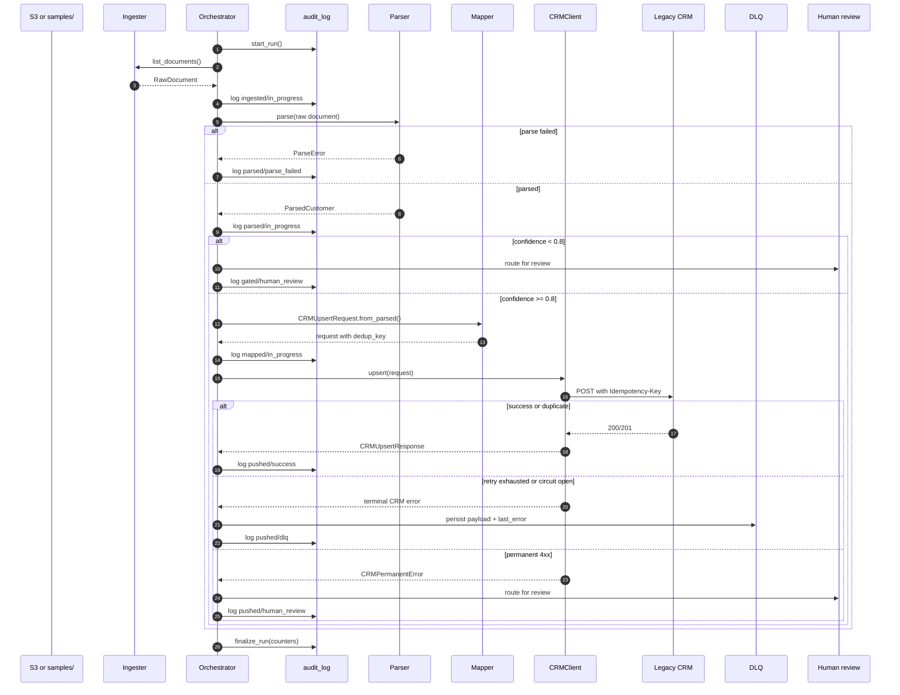
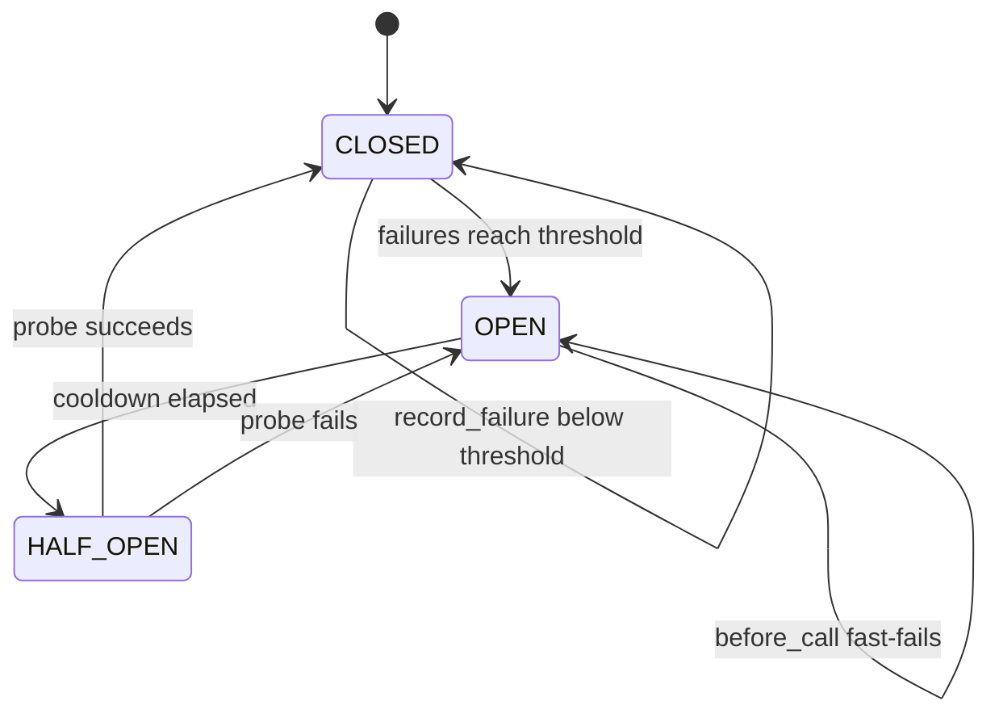

# Architecture

This document is the technical companion to the README. It explains what the
assignment asked for, what the implementation does, why the design choices were
made, and how the system behaves when the CRM or input data is unreliable.

---

## 1. Problem Framing

The assignment is not just "call an LLM." It is an integration problem:

- The input source is S3-shaped enterprise data.
- The input data is messy: emails, CSV rows, OCR, JSON exports, and notes.
- The downstream CRM is legacy and undocumented.
- The downstream CRM can rate-limit or fail.
- The system must still update the client system safely.

The core product risk is data trust. A bad parser can corrupt CRM records. A bad
retry strategy can double-create customers. A bad failure strategy can silently
drop records. The architecture is built around those risks.

---

## 2. Goals And Non-Goals

Goals:

- Provide a runnable end-to-end workflow.
- Make the data path explicit and easy to review.
- Parse messy documents into a strict customer schema.
- Retry transient CRM failures without retrying permanent data errors.
- Prevent duplicate CRM mutation during retries and replays.
- Preserve an audit trail for every record.
- Keep failed CRM pushes replayable through a DLQ.

Non-goals for the assignment:

- Build a production S3 connector with IAM and boto3.
- Build a human-review UI.
- Build a distributed worker system.
- Add a full observability stack.
- Hide the workflow behind a large agent framework.

The non-goals are intentional. They keep the submission focused on the problem
statement while leaving clean extension points for production.

---

## 3. System Overview



The orchestrator is the only place that knows the whole pipeline. Every other
module has one job:

| Module | Responsibility |
|---|---|
| `ingest.py` | Produce `RawDocument` objects from a source |
| `parser.py` | Convert `RawDocument` into `ParsedCustomer` |
| `schemas.py` | Enforce data contracts and compute CRM idempotency keys |
| `orchestrator.py` | Run the per-record state machine |
| `crm_client.py` | Call the CRM with retry, breaker, and idempotency |
| `circuit_breaker.py` | Track downstream health |
| `audit.py` | Persist audit rows and DLQ entries |
| `mock_crm/server.py` | Simulate an unreliable legacy CRM |

---

## 4. End-To-End Record Flow



The record-level invariant is: one bad document cannot stop the rest of the
run. Parse failures, permanent CRM rejections, and transient CRM outages are
classified differently and routed differently.

---

## 5. Data Contracts

The pipeline moves through four main models:

```text
RawDocument
  source_id
  format
  body
  ingested_at

ParsedCustomer
  source_id
  customer_id
  name
  email
  phone
  company
  address
  notes
  confidence

CRMUpsertRequest
  customer fields
  dedup_key

CRMUpsertResponse
  customer_id
  status
  crm_record_id
  received_at
```

Pydantic is used as the boundary between "LLM may be wrong" and "integration
payload must be trusted." Invalid emails, invalid phone numbers, missing names,
and unexpected fields fail early. The orchestrator then records the failure and
continues.

---

## 6. Parser Strategy

There are two parser implementations behind the same `Parser` protocol.

`OpenRouterParser`:

- Uses the OpenAI-compatible SDK against OpenRouter.
- Sends a strict extraction prompt.
- Requests structured output in the shape of `ParsedCustomer`.
- Re-validates with Pydantic after the model response.
- Uses `temperature=0.0` for reproducibility.

`MockParser`:

- Uses deterministic Python parsing and regexes.
- Requires no API key.
- Runs in CI and local demos.
- Exercises the same downstream code path as the real parser.

The mock parser is not pretending to be as capable as an LLM. It exists so the
integration logic can be reviewed and tested without secrets, quota, network
latency, or nondeterministic model behavior.

---

## 7. Why This Is Not LangChain Or LangGraph

The "agent" decision in this assignment is narrow: extract a structured
customer record from an unstructured document. After that, the system is normal
integration engineering:

- validate
- gate
- map
- retry
- audit
- dead-letter
- replay

A graph framework would add vocabulary and callbacks around logic that is
already clear as a typed state machine. The code intentionally keeps the LLM
call small and keeps the reliability logic explicit.

When a framework would make sense:

- The LLM needs to choose between multiple tools.
- The LLM needs multi-step planning.
- The workflow has dynamic branches that are not known upfront.
- The system needs durable graph checkpointing across tool calls.

That is not the main risk in this assignment. The main risk is safe enterprise
system integration.

---

## 8. CRM Resilience Design

The CRM client has four layers:

```text
upsert(request)
  -> circuit_breaker.before_call()
  -> tenacity retry loop
  -> httpx POST /v0/customer.upsert
  -> translate HTTP result into typed success/error
```

Retry policy:

- Retry `429`, `500`, `502`, `503`, `504`.
- Retry connection-level `httpx.HTTPError`.
- Use exponential backoff with jitter.
- Do not retry permanent `4xx` errors other than `429`.

Why this matters:

- Retrying `429` and `5xx` helps with temporary CRM instability.
- Jitter avoids every worker retrying at the same time.
- Not retrying `422` or `400` avoids wasting attempts on bad data.
- Separating transient and permanent errors makes downstream behavior easier to
  reason about.

Circuit breaker states:



The breaker is there for sustained downstream failure. Retries are useful for a
few bad responses. A circuit breaker is useful when the dependency is unhealthy
for longer than one record.

---

## 9. Idempotency Design

Retries can create duplicates if the CRM accepts a request but the client loses
the response. The solution is an idempotency key.

`CRMUpsertRequest.from_parsed()` computes:

```text
sha256(customer_id | name | email | phone | company | address | notes)
```

That value is sent in the `Idempotency-Key` header and stored in the body.

Why use the canonical payload instead of only `customer_id`:

- Same payload replay: same key, no duplicate mutation.
- Corrected payload: different key, CRM can apply a real update.
- Duplicate S3 object: same key, safe no-op in the CRM.

The mock CRM stores seen keys. A repeated request returns `200` with
`status="duplicate"` and the original `crm_record_id`.

---

## 10. Audit Log And DLQ

The audit log is write-before-act. The orchestrator writes an `in_progress` row
before a step runs, then writes the terminal outcome after that step resolves.

This gives three benefits:

- A crash leaves evidence of what was in flight.
- A reviewer can inspect the path each document took.
- Replays are easier because successful CRM mutations are idempotent.

DLQ entries contain:

- run id
- source id
- customer id
- original CRM payload
- last error
- attempt count
- timestamps

Replay uses the same `CRMClient`, which means the same idempotency key,
retry policy, and circuit breaker behavior apply.

---

## 11. Failure Matrix

| Failure | Where it appears | System behavior |
|---|---|---|
| Unreadable local object | `FileIngester` | Skip binary/unreadable file in demo |
| LLM output invalid | `Parser` / Pydantic | Raise `ParseError`, log `parse_failed`, continue |
| Low confidence extraction | `Orchestrator` | Route to `human_review`, do not call CRM |
| CRM `429` | `CRMClient` | Retry with backoff and jitter |
| CRM `503` or other retryable `5xx` | `CRMClient` | Retry with backoff and jitter |
| CRM connection error | `CRMClient` | Retry as transient |
| CRM `422` or permanent `4xx` | `CRMClient` | Route to `human_review`, do not trip breaker |
| Retry exhaustion | `CRMClient` -> `Orchestrator` | Persist to DLQ |
| Circuit breaker open | `CircuitBreaker` | Fast-fail to DLQ without socket call |
| Duplicate S3 record | CRM idempotency | Return `duplicate`, no second mutation |
| Process crash mid-record | Audit log | Last logged step shows where it stopped |

---

## 12. Runtime And Demo Expectations

During the demo, `make mock-crm` starts a FastAPI API server on port `8765`.
The server intentionally injects faults:

- default `429` rate: `10%`
- default `503` rate: `5%`
- default latency: `20-120 ms`

That means the terminal may show `429` or `503` responses. This is expected.
The interesting signal is whether `make run-mock-llm` completes and prints the
summary table.

The mock CRM has no homepage. These browser routes are expected:

| URL | Expected |
|---|---|
| `/` | `404 {"detail":"Not Found"}` |
| `/health` | `{"status":"ok"}` |
| `/docs` | FastAPI docs |
| `/v0/admin/records` | CRM records created during the run |

---

## 13. Production Extension Path

If this became a real client deployment, the next changes would be local and
predictable:

| Demo component | Production replacement |
|---|---|
| `FileIngester` | `S3Ingester` using boto3 paginator and object reads |
| SQLite audit store | Postgres or warehouse-backed audit tables |
| Per-process circuit breaker | Redis-backed or platform-managed breaker state |
| Local process | Worker deployment with queue-based fanout |
| Mock CRM | Client CRM base URL and auth |
| Human-review status | Review queue plus small internal UI |
| Structlog stdout | OpenTelemetry or SIEM log shipping |

The interfaces are already separated so these are implementation swaps, not a
rewrite of the orchestrator.

---

## 14. Security And Secrets

Security controls in the repo:

- `.env` is gitignored.
- `.env.example` contains placeholders.
- API keys are read from environment variables.
- Settings use Pydantic `SecretStr`.
- Log redaction catches common API-key, bearer-token, and JWT shapes.
- CI runs the mock parser, not the real LLM path.
- Security workflow runs Gitleaks and CodeQL.

Known production gaps:

- Audit rows are not tamper-evident.
- Parsed PII is stored in the local audit DB.
- CRM auth is not modeled in the mock.
- mTLS, KMS, and retention policies are out of scope for this assignment.

---

## 15. Reviewer Talking Points

If asked "what did you build?":

> I built a runnable AI-assisted onboarding integration. It ingests messy
> customer documents, extracts structured customer data, validates and gates it,
> and pushes it to a flaky legacy CRM through a resilient client.

If asked "what makes it production-minded?":

> The reliability details are real: retries only for transient failures,
> exponential backoff with jitter, idempotency keys, a circuit breaker, DLQ
> replay, and a write-before-act audit trail.

If asked "why not a bigger agent framework?":

> The LLM is doing extraction, not planning. The important engineering here is
> deterministic integration behavior, so I kept the orchestration explicit.

If asked "what would you change in production?":

> I would replace local files with boto3 S3 reads, move SQLite to Postgres,
> centralize breaker state in Redis or platform infrastructure, add CRM auth,
> and build a human-review UI around the existing review states.
