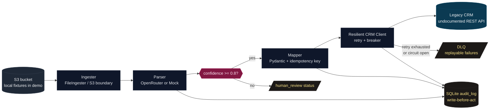

# Agentic Onboard

AI-assisted customer onboarding pipeline for the UnifyApps FDSE assignment.

This repo demonstrates an enterprise integration workflow that reads messy
customer data, extracts structured records with an LLM-shaped parser, and
updates a flaky legacy CRM safely using retries, idempotency, a circuit breaker,
a dead-letter queue, and an audit log.

Built by [Prakhar Shekhar Parthasarthi](https://github.com/praxstack).

[](https://github.com/praxstack/unifyapps-fdse-assignment/actions/workflows/ci.yml)
[](https://github.com/praxstack/unifyapps-fdse-assignment/actions/workflows/security.yml)
[](LICENSE)
[](https://www.python.org/downloads/)

---

## The Assignment, In Simple Terms

UnifyApps asked for an AI agent-driven integration design:

- Customer onboarding data is sitting in S3.
- The data is messy and unstructured.
- A legacy CRM has an undocumented REST API.
- The CRM may rate-limit or fail.
- The workflow must parse the data with an LLM and update the CRM reliably.

In plain English: build a small production-minded pipeline from messy documents
to a flaky enterprise system, and explain the architecture clearly.

This repository goes beyond pseudocode. It contains a runnable implementation,
a mock legacy CRM that intentionally fails, tests, and the architecture notes.

---

## What Was Asked vs. What This Repo Delivers

| Assignment requirement | This repo |
|---|---|
| Architecture diagram | Mermaid diagrams in this README and [ARCHITECTURE.md](ARCHITECTURE.md) |
| Data-flow mapping | End-to-end flow from ingest to audit/DLQ |
| S3 data ingestion | `FileIngester` simulates the bucket with local fixtures; `S3Ingester` marks the boto3 swap boundary |
| LLM parsing | `OpenRouterParser` for a real LLM path; `MockParser` for deterministic demos and CI |
| Legacy REST API integration | `CRMClient` calls `POST /v0/customer.upsert` |
| API rate-limit/failure handling | Retries with exponential backoff and jitter, circuit breaker, DLQ replay |
| Successful client-system update | Mock CRM records are created/updated/idempotently deduplicated |
| Demonstrable script | `agentic-onboard run samples/` and `make run-mock-llm` |

---

## 90-Second Demo Path

Terminal 1:

```bash
cd ~/Documents/workspace/unifyapps-fdse-assignment
source .venv/bin/activate
make mock-crm
```

Terminal 2:

```bash
cd ~/Documents/workspace/unifyapps-fdse-assignment
source .venv/bin/activate
make run-mock-llm
```

Expected result:

- `8` documents ingested from `samples/`
- `6` clean customer upserts
- `1` duplicate caught by idempotency
- `1` intentionally malformed record rejected by the parser
- `0` DLQ entries in a normal demo run
- CRM logs may show `429 Too Many Requests` or `503 Service Unavailable`; those
  are intentional fault injections and prove the retry layer is active.

Important browser note:

The mock CRM is an API server, not a website. Opening
`http://127.0.0.1:8765/` returns `404 {"detail":"Not Found"}` by design. Use:

- `http://127.0.0.1:8765/health` to check the server is alive
- `http://127.0.0.1:8765/docs` to inspect FastAPI docs
- `http://127.0.0.1:8765/v0/admin/records` to inspect created CRM records

So if the terminal pipeline succeeds but `/` shows `404`, the project is
working.

---

## Architecture



Hot path:

```text
ingest raw document
  -> parse customer fields
  -> validate schema
  -> confidence gate
  -> map to CRM payload
  -> compute idempotency key
  -> POST to CRM with retry + circuit breaker
  -> write audit outcome
```

Failure side paths:

- Parse failure: record as `parse_failed`; continue the run.
- Low confidence: mark `human_review`; do not call the CRM.
- Permanent CRM rejection, such as `422`: mark `human_review`; do not retry.
- Transient CRM failure, such as `429` or `503`: retry with backoff and jitter.
- Retry exhaustion or open circuit: write to the DLQ for later replay.

For the deeper design, see [ARCHITECTURE.md](ARCHITECTURE.md).

---

## Why The Design Looks This Way

The assignment is about forward-deployed engineering judgment. The hard part is
not calling an LLM. The hard part is making the integration safe when the data
is messy and the downstream system is unreliable.

Key choices:

| Choice | Why |
|---|---|
| Plain Python orchestrator | The workflow is a deterministic integration pipeline with one LLM extraction step. A heavy agent framework would hide the important error handling. |
| Protocols for `Ingester` and `Parser` | The orchestrator depends on interfaces, not boto3 or a specific model vendor. |
| Mock LLM shipped in repo | Reviewers can run the demo without API keys, and CI stays deterministic. |
| Real OpenRouter path | The same parser contract supports a real LLM when `OPENROUTER_API_KEY` is present. |
| Strict Pydantic models | Bad LLM output fails before it reaches the CRM. |
| Retry only transient errors | `429`, `5xx`, and connection errors may recover. Other `4xx` errors are data/API problems. |
| Idempotency key from canonical payload | Replays and network ambiguity do not double-create CRM records. |
| Circuit breaker | If the CRM is actually down, the pipeline stops hammering it and fast-fails to DLQ. |
| SQLite audit + DLQ | Enough for a runnable assignment, easy to inspect, and maps directly to Postgres in production. |

---

## Core Files

| File | Purpose |
|---|---|
| [src/agentic_onboard/orchestrator.py](src/agentic_onboard/orchestrator.py) | End-to-end agent loop and routing decisions |
| [src/agentic_onboard/ingest.py](src/agentic_onboard/ingest.py) | File-backed S3 simulation and S3 interface boundary |
| [src/agentic_onboard/parser.py](src/agentic_onboard/parser.py) | OpenRouter parser and deterministic mock parser |
| [src/agentic_onboard/schemas.py](src/agentic_onboard/schemas.py) | Pydantic contracts and idempotency-key construction |
| [src/agentic_onboard/crm_client.py](src/agentic_onboard/crm_client.py) | HTTP client, retry policy, breaker integration |
| [src/agentic_onboard/circuit_breaker.py](src/agentic_onboard/circuit_breaker.py) | Three-state circuit breaker |
| [src/agentic_onboard/audit.py](src/agentic_onboard/audit.py) | SQLite audit log and DLQ |
| [src/mock_crm/server.py](src/mock_crm/server.py) | Fault-injecting mock legacy CRM |
| [samples/](samples/) | Messy onboarding documents used as the local S3 bucket |
| [tests/](tests/) | Unit and integration-style tests |

---

## Sample Inputs

The `samples/` directory acts as the S3 bucket for the assignment demo.

| File | Shape | Why it exists |
|---|---|---|
| `01-email-thread.eml` | Email thread | Typical sales/onboarding handoff |
| `02-crm-export.json` | JSON with odd keys | Vendor export with non-standard field names |
| `03-csv-row.csv` | CSV row | Spreadsheet import |
| `04-handwritten-form.ocr.json` | OCR output | Scanned paper form |
| `05-freeform-note.txt` | Freeform note | Sales rep notes |
| `06-ambiguous-snippet.txt` | Bad partial data | Proves parse failure does not crash the run |
| `07-spreadsheet-paste.csv` | Quoted CSV | Messy pasted spreadsheet data |
| `08-replay-of-01.eml` | Duplicate of #1 | Proves idempotency |

---

## Local Setup

```bash
git clone https://github.com/praxstack/unifyapps-fdse-assignment
cd unifyapps-fdse-assignment
make install
source .venv/bin/activate
```

Run with the mock LLM:

```bash
make mock-crm
# in another terminal
make run-mock-llm
```

Run with a real LLM through OpenRouter:

```bash
cp .env.example .env
# set OPENROUTER_API_KEY in .env
LLM_PROVIDER=openrouter agentic-onboard run samples/
```

Docker path:

```bash
docker compose up --build mock-crm
# in another shell
docker compose --profile demo up orchestrator
```

---

## Verification

Current local verification from the repo virtualenv:

```bash
.venv/bin/python -m pytest --cov=src --cov-report=term-missing --cov-report=xml
.venv/bin/python -m ruff check src tests
.venv/bin/python -m mypy src
```

Observed result:

- `76 passed`
- `73.66%` total coverage
- Ruff clean
- Mypy strict clean across `13` source files

CI runs Python `3.12` with the deterministic mock LLM. Local shells may show a
newer Python inside `.venv`; that is fine as long as the commands above pass.

---

## Resilience Behavior

The CRM call is protected by four layers:

```text
CRMUpsertRequest
  -> Idempotency-Key header
  -> CircuitBreaker.before_call()
  -> Tenacity retry loop
  -> httpx POST /v0/customer.upsert
```

What happens on common failures:

| Failure | Behavior |
|---|---|
| `429 Too Many Requests` | Retry with exponential backoff and jitter |
| `503 Service Unavailable` | Retry with exponential backoff and jitter |
| Connection refused / timeout | Retry as transient |
| Repeated transient failures | Circuit breaker opens after threshold |
| Circuit open | Record goes to DLQ without opening a socket |
| `422` or other permanent `4xx` | Human review, no retry, breaker not tripped |
| Duplicate replay | CRM returns `status="duplicate"` and does not mutate again |

DLQ commands:

```bash
agentic-onboard dlq list
agentic-onboard dlq replay
```

Audit command:

```bash
agentic-onboard audit <run_id>
```

---

## Interview Cheat Sheet

Short version:

> I built an AI-assisted onboarding integration. It ingests messy customer
> documents, parses them into a strict schema, gates low-confidence records,
> maps valid records into CRM upserts, and sends them through a resilient client
> that handles rate limits, 5xx failures, retries, idempotency, circuit breaking,
> DLQ replay, and audit logging.

Design explanation:

> I avoided a heavy agent framework because the LLM is doing one job:
> extraction. The rest is deterministic integration work. That makes the code
> easier to audit and lets the important reliability decisions stay explicit.

Resilience explanation:

> I retry only transient CRM failures: `429`, `5xx`, and connection errors.
> Permanent `4xx` errors go to human review because retrying bad data just
> burns quota. Idempotency keys make retry and replay safe, and the circuit
> breaker protects the CRM when it is truly unhealthy.

Demo explanation:

> The mock CRM intentionally returns `429` and `503`, so the demo proves the
> retry path instead of just claiming it exists. The duplicate sample proves
> idempotency, and the malformed sample proves bad data does not kill the run.

Honest limitations:

> For the assignment I used local files to simulate S3. The ingester interface
> is where boto3 would plug in. SQLite is used for demo audit/DLQ storage; in
> production I would move that to Postgres and centralize circuit-breaker state
> in Redis or platform infrastructure.

---

## Security Notes

This is a public repo with an optional real LLM path, so secrets are handled
defensively:

- `.env` is ignored; `.env.example` contains placeholders only.
- `OPENROUTER_API_KEY` is read from environment settings, not hardcoded.
- API keys use Pydantic `SecretStr`.
- Logs pass through a redactor for OpenAI/OpenRouter/Anthropic/Bearer/JWT-like
  secrets.
- CI runs with `LLM_PROVIDER=mock`, so no real LLM key is needed in GitHub
  Actions.
- Security workflow runs Gitleaks and CodeQL.

---

## What Is Deliberately Out Of Scope

- Full boto3 S3 implementation. The interface is present; local fixtures keep
  the assignment runnable.
- Human-review UI. The state is represented in the audit log.
- Distributed circuit-breaker state. The demo breaker is per process.
- Production observability stack. Logs are structured, but not shipped to a
  SIEM in this assignment.
- Tamper-evident audit storage. SQLite is enough for the demo; production would
  use stricter storage and retention controls.

---

## Troubleshooting

`http://127.0.0.1:8765/` shows `404`.

This is expected. The mock CRM is an API server. Use `/health`, `/docs`, or
`/v0/admin/records`.

`ModuleNotFoundError: httpx` or another dependency error.

Use the project virtualenv:

```bash
source .venv/bin/activate
make install
```

Or run tools directly through the venv:

```bash
.venv/bin/python -m pytest
```

`make run-mock-llm` exits non-zero.

Check whether the summary shows DLQ entries. The CLI intentionally exits with
code `1` if records land in the DLQ, because that is useful for CI. Start or
restart the mock CRM, then replay:

```bash
agentic-onboard dlq list
agentic-onboard dlq replay
```

---

## Contact

Prakhar Shekhar Parthasarthi

- GitHub: [github.com/praxstack](https://github.com/praxstack)
- LinkedIn: [linkedin.com/in/prakharshekhar](https://www.linkedin.com/in/prakharshekhar)
- Email: `prakhar.mnnit.2022@gmail.com`
