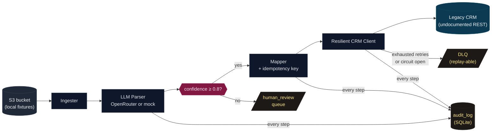
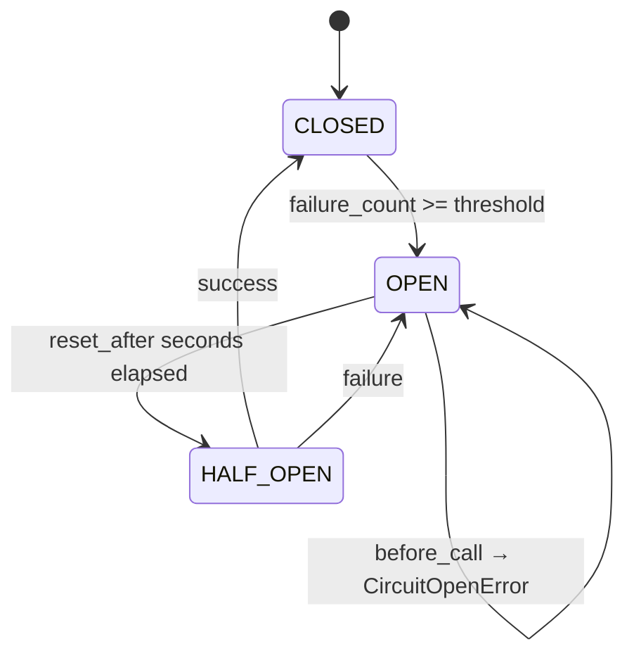

# Agentic Onboard

> **An AI-agent-driven workflow that ingests messy enterprise data from "S3", parses it with an LLM, and reliably updates a flaky legacy CRM — with idempotency, exponential backoff, a circuit breaker, a DLQ, and a full audit trail.**
>
> Submission for the **UnifyApps Sr. FDSE assignment** ([problem statement](#problem-statement)).
> Built by **[Prakhar Shekhar Parthasarthi](https://github.com/praxstack)** · `prakhar.mnnit.2022@gmail.com`

[](https://github.com/praxstack/unifyapps-fdse-assignment/actions/workflows/ci.yml)
[](https://github.com/praxstack/unifyapps-fdse-assignment/actions/workflows/security.yml)
[](LICENSE)
[](https://www.python.org/downloads/)
[](#tests)

---

## TL;DR

```bash
git clone https://github.com/praxstack/unifyapps-fdse-assignment
cd unifyapps-fdse-assignment
make install
# Terminal 1: start the mock legacy CRM (it injects 429s and 503s on purpose)
make mock-crm
# Terminal 2: run the pipeline against local "S3" fixtures
make run-mock-llm
```

You'll see eight messy customer documents (emails, JSON, OCR scans, freeform notes) get parsed, validated, and pushed to the mock CRM. The mock CRM rate-limits and 5xxs ~15% of requests at random; you'll watch the client retry with exponential backoff, fall through to a circuit breaker if things stay broken, and dead-letter records that exhaust their retries. A run typically completes in **under one second** and produces a clean summary table.

No OpenAI key required: the default `LLM_PROVIDER=mock` runs a deterministic regex parser that exercises every code path the real LLM does. Real OpenRouter LLM available via `make run` once you set `OPENROUTER_API_KEY` in `.env`.

---

## Architecture



The hot path is **Ingest → Parse → Gate → Map → Push**. Three side-channels feed the audit story: `human_review` (low-confidence parses), `DLQ` (failed pushes), and `audit_log` (every step, before it runs, so a crash is replayable).

Data-flow detail in [`ARCHITECTURE.md`](ARCHITECTURE.md). One-line diagram of the resilience layers around the CRM client:

```
upsert(req) → CircuitBreaker.before_call → Tenacity(exp-backoff+jitter) → httpx.post(/v0/customer.upsert, Idempotency-Key=…)
```

---

## Problem statement

> **Enterprise Data & Agentic Workflow Integration.** An enterprise client wants to automate their customer onboarding. They have a legacy CRM with an *undocumented REST API* and unstructured data sitting in an *AWS S3 bucket*. Architect an AI agent-driven workflow that can:
>
> - **Ingest** the S3 data
> - **Parse** it using an LLM
> - **Handle errors** if the legacy API rate-limits or fails
> - Successfully **update the client system**
>
> *Expectation:* brief architecture diagram, data-flow mapping, sample pseudo-code or an actual script demonstrating integration + API resilience.

This repo is the actual script + the resilience patterns + the architecture write-up.

---

## Resilience patterns

The five things the prompt explicitly asks for ("handle errors if the legacy API rate-limits or fails"), all demonstrably real — every one is exercised by tests *and* by the live demo against the fault-injecting mock CRM.

### 1. Idempotency keys

Every CRM upsert carries `Idempotency-Key: sha256(customer_id || canonical_payload)` in the header. The mock CRM short-circuits replays to `200 OK` with `status="duplicate"` and the original `crm_record_id`.

```python
# src/agentic_onboard/schemas.py
@classmethod
def from_parsed(cls, parsed: ParsedCustomer) -> CRMUpsertRequest:
    canonical = f"{parsed.customer_id}|{parsed.name}|{parsed.email}|..."
    digest = hashlib.sha256(canonical.encode("utf-8")).hexdigest()
    return cls(..., dedup_key=digest)
```

In the demo run, document `08-replay-of-01.eml` is intentionally a re-send of `01-email-thread.eml`. It produces the same dedup key and lands as `duplicates: 1` instead of creating a second record.

### 2. Exponential backoff + jitter

Powered by [`tenacity`](https://tenacity.readthedocs.io/), retrying *only* on `429`, `5xx`, and connection-level errors. Anything else 4xx (e.g. `422 unprocessable`) is a permanent failure that surfaces immediately — retrying a programmer error is wasted effort.

```python
# src/agentic_onboard/crm_client.py
retryer = Retrying(
    stop=stop_after_attempt(self._settings.retry_max_attempts),
    wait=wait_exponential_jitter(
        initial=self._settings.retry_initial_backoff_s,
        max=self._settings.retry_max_backoff_s,
        jitter=self._settings.retry_initial_backoff_s,
    ),
    retry=retry_if_exception_type(CRMRetriableError),
    reraise=True,
)
```

### 3. Circuit breaker

Hand-rolled (no library dependency — see [`src/agentic_onboard/circuit_breaker.py`](src/agentic_onboard/circuit_breaker.py)). Three states: `CLOSED → OPEN → HALF_OPEN → CLOSED`. After `N` consecutive failures the breaker opens and fast-fails subsequent requests with `CircuitOpenError`, never even opening the socket. After a cooldown it allows one probe; success closes it, failure re-opens.



### 4. Dead-letter queue (DLQ)

Every record that exhausts its retries (or hits the circuit breaker) lands in the `dlq` SQLite table with the original payload, last error, attempt count, and timestamps. The `agentic-onboard dlq replay` command re-attempts every entry; idempotency keys make replay safe, even after the CRM has come back up and partially processed earlier attempts.

```bash
$ agentic-onboard dlq         # list
$ agentic-onboard dlq replay  # re-attempt all
```

### 5. Audit log

Every pipeline step writes a row to the `audit_log` table **before** that step runs. So a crash mid-record always leaves the database in a state where you can see exactly which step was in flight. The audit log is the source of truth for compliance, debugging, and post-mortem — not the CRM (which is treated as untrusted).

```bash
$ agentic-onboard audit <run_id>
```

---

## Sample run

```text
$ make run-mock-llm
LLM_PROVIDER=mock agentic-onboard run samples/

run.start                        llm_provider=mock run_id=0dfc6b1bb5d34ebba6b23ed1b94ac67c
HTTP Request: POST http://127.0.0.1:8765/v0/customer.upsert "HTTP/1.1 201 Created"
HTTP Request: POST http://127.0.0.1:8765/v0/customer.upsert "HTTP/1.1 429 Too Many Requests"
crm.retriable                    attempt=1 customer_id=aanya@vrindavan-co.example status=429
HTTP Request: POST http://127.0.0.1:8765/v0/customer.upsert "HTTP/1.1 201 Created"
HTTP Request: POST http://127.0.0.1:8765/v0/customer.upsert "HTTP/1.1 201 Created"
HTTP Request: POST http://127.0.0.1:8765/v0/customer.upsert "HTTP/1.1 201 Created"
HTTP Request: POST http://127.0.0.1:8765/v0/customer.upsert "HTTP/1.1 201 Created"
record.parse_failed              error=no email found in document source_id=06-ambiguous-snippet.txt
HTTP Request: POST http://127.0.0.1:8765/v0/customer.upsert "HTTP/1.1 201 Created"
HTTP Request: POST http://127.0.0.1:8765/v0/customer.upsert "HTTP/1.1 200 OK"
run.end                          dlq=0 duplicates=1 duration_ms=576 human_review=0 parse_failed=1 succeeded=6 total=8

  Pipeline run 0dfc6b1b — 576 ms
┏━━━━━━━━━━━━━━━━━━━━━━━━━┳━━━━━━━┓
┃ metric                  ┃ count ┃
┡━━━━━━━━━━━━━━━━━━━━━━━━━╇━━━━━━━┩
│ total ingested          │     8 │
│ succeeded               │     6 │
│ duplicates (idempotent) │     1 │
│ human review            │     0 │
│ parse failed            │     1 │
│ DLQ                     │     0 │
└─────────────────────────┴───────┘
llm_provider=mock | crm=http://127.0.0.1:8765 | retries=5 | breaker=5/15.0s
```

What you can read from this:

- 8 raw documents in `samples/` were ingested, parsed, and 6 of them landed cleanly in the (mock) CRM.
- 1 was a *replay* (file `08` is a resend of file `01`); the dedup key matched, the CRM returned `200 OK status=duplicate`, no second record was created.
- 1 file (`06-ambiguous-snippet.txt`) was deliberately malformed — only a partial email, no TLD; the parser refused it cleanly. It does *not* land in the DLQ (parse failures and CRM failures are distinct categories).
- The 429 from the mock CRM (random fault injection) was retried successfully on the next attempt.
- Total wall time: **576 ms** for 8 records against a flaky downstream.

---

## Sample inputs

The `samples/` directory simulates an S3 bucket of "messy enterprise data". Eight documents in five different formats:

| File | Format | Realism |
|---|---|---|
| `01-email-thread.eml` | Email (RFC822-ish) | Inbound onboarding request from a sales lead |
| `02-crm-export.json` | JSON with non-standard keys (`tel`, `addr`, `customer_name`) | Export from another vendor's CRM |
| `03-csv-row.csv` | CSV row with header | Import from a spreadsheet |
| `04-handwritten-form.ocr.json` | OCR output (text + structured fields + confidence) | Scanned paper form, low OCR confidence |
| `05-freeform-note.txt` | Unstructured ticket comment | Sales rep's notes |
| `06-ambiguous-snippet.txt` | Deliberately bad: partial email | Edge case — should reject |
| `07-spreadsheet-paste.csv` | Quoted CSV with non-standard column names | Pasted from a spreadsheet |
| `08-replay-of-01.eml` | Replay of #01 | Demonstrates idempotency |

Each file is small enough to read at a glance, varied enough to exercise different LLM-prompt branches.

---

## Quickstart

### Local (Python 3.12+)

```bash
git clone https://github.com/praxstack/unifyapps-fdse-assignment
cd unifyapps-fdse-assignment
make install                         # creates .venv via uv or falls back to pip
cp .env.example .env                 # then edit OPENROUTER_API_KEY if you want real LLM

# Terminal 1
make mock-crm                        # starts the FastAPI mock CRM on :8765

# Terminal 2
make run-mock-llm                    # default: deterministic mock parser, no API key
# or
make run                             # uses OpenRouter (requires OPENROUTER_API_KEY)
```

### Docker

```bash
docker compose up --build mock-crm   # mock CRM in a container
# in another shell
docker compose --profile demo up orchestrator
```

### CI test suite

```bash
make test          # 76 tests, ~2 seconds, ≥80% branch coverage
make lint          # ruff check + format check
make typecheck     # mypy strict
```

---

## Why these choices (signals seniority)

A senior engineer leaves design rationale alongside code. A few of the load-bearing decisions and why they're not what an LLM would naively do:

- **Hand-rolled circuit breaker, not `pybreaker`.** The pattern is twenty lines and a library would obscure it. Reviewers see exactly how the breaker decides to trip and recover. *Build vs. wrap; UnifyApps cares about this distinction.*
- **No LangChain / LangGraph / CrewAI.** The agent loop is a `for doc in ingester` with a typed state machine and explicit error handling. An "agent framework" here would add three abstraction layers and zero capability. Boring is good.
- **Pydantic Settings + Protocol-based interfaces.** The orchestrator depends on the `Ingester` and `Parser` Protocols, not on `boto3` or `OpenAI`. Swapping S3 in for the file backend, or Anthropic for OpenRouter, is a one-class change. The `S3Ingester` stub in `src/agentic_onboard/ingest.py` is left in-tree as a contract reminder.
- **Audit log writes *before* the step runs.** Standard "outbox pattern" trick — at any point a crashed run can be replayed from the audit log. Write-after-step would lose the in-flight record.
- **OpenRouter, not direct OpenAI.** OpenRouter is a single endpoint that fronts every major model (OpenAI, Anthropic, Google, Mistral, …) with the OpenAI-compatible SDK. Same code path benchmarks against any model with one env var change.
- **Mock LLM is shipped, not just a stub.** A reviewer can `git clone && make run-mock-llm` with zero setup. CI runs against the mock so secrets never enter GitHub Actions.
- **Hand-rolled SQLite, not SQLAlchemy.** The schema is two tables. An ORM would bury the SQL. Recruiters reading this can see every statement at a glance.
- **`Idempotency-Key` is computed from the canonical payload, not the customer_id alone.** So a *changed* record produces a *different* key and triggers an actual CRM update. Pure customer-id keys would silently lose data on re-imports.
- **Permanent (4xx) errors don't trip the breaker.** They're a programmer/data bug, not a downstream issue; the breaker is for downstream health, not data quality. They route to `human_review`.

---

## Security & secrets

This repo is public. The defenses against committing API keys, in order:

1. **`.gitignore`** blocks `.env`, `*.key`, `*.pem`, `secrets/`. Only `.env.example` (placeholder values) is in the repo.
2. **Pydantic Settings** reads `OPENROUTER_API_KEY` from env; never hardcoded.
3. **`SecretStr`** wraps the key in memory; printing the settings prints `SecretStr('**********')`.
4. **Log redactor** (`src/agentic_onboard/logging_config.py`) pattern-matches OpenRouter / OpenAI / Anthropic / Bearer / JWT-shaped strings and replaces them with `***REDACTED***`. Tested against six secret formats.
5. **Pre-commit hook** runs `gitleaks` locally so leaks are caught before they hit GitHub.
6. **GitHub Actions Security workflow** (`gitleaks-action` + `CodeQL`) scans every PR + weekly cron.
7. **CI runs against the mock LLM only** — `OPENROUTER_API_KEY` never enters Actions.
8. **Docker image** does not `COPY` the `.env`; secrets are mounted at runtime.

Rotate your OpenRouter key after the demo at <https://openrouter.ai/keys>.

---

## Tests

```text
$ make test

tests/test_audit.py ............      [ 15%]
tests/test_circuit_breaker.py ......  [ 23%]
tests/test_crm_client.py .........    [ 35%]
tests/test_ingest.py ........         [ 45%]
tests/test_logging_redaction.py ..... [ 57%]
tests/test_mock_crm.py .....          [ 64%]
tests/test_orchestrator.py ........   [ 75%]
tests/test_parser.py ........         [ 86%]
tests/test_schemas.py ..............  [100%]

76 passed in 1.27s
```

What's covered:

- **Schemas** — phone normalisation across five real-world formats, dedup-key determinism, schema strictness, hypothesis property tests on the dedup hash
- **Circuit breaker** — full state-machine coverage including HALF_OPEN failure → OPEN
- **CRM client** — happy path, 429 retry, 503 retry, exhausted retries, permanent (4xx) errors, breaker tripping, idempotency-key header, connection-error retry
- **Mock CRM** — health, create, replay-with-same-key returns duplicate, missing key/required fields rejected
- **Audit + DLQ** — run lifecycle, log appending, DLQ upsert (attempt counter), DLQ scoping
- **Orchestrator** — clean run, idempotent replay (5 records → 5 created → re-run → 5 duplicates), parse failures don't crash run, exhausted retries → DLQ, recovered CRM → replay succeeds
- **Logging redaction** — six secret formats including JWT shape

```bash
make cov   # opens htmlcov/index.html
```

---

## Repository layout

```
unifyapps-fdse-assignment/
├── README.md                       # ← you are here
├── ARCHITECTURE.md                 # data-flow + design decisions in depth
├── pyproject.toml                  # uv / pip, ruff, pytest, mypy, coverage
├── Makefile                        # one-line entry points
├── Dockerfile                      # multi-stage, non-root user
├── docker-compose.yml              # mock-crm + orchestrator profile
├── .pre-commit-config.yaml         # gitleaks + ruff + private-key detection
├── .github/workflows/
│   ├── ci.yml                      # lint + typecheck + tests
│   └── security.yml                # gitleaks + CodeQL
├── src/
│   ├── agentic_onboard/
│   │   ├── settings.py             # Pydantic Settings, single source of config
│   │   ├── logging_config.py       # structlog + secret redactor
│   │   ├── schemas.py              # RawDocument, ParsedCustomer, CRMUpsertRequest
│   │   ├── ingest.py               # FileIngester + S3Ingester stub
│   │   ├── parser.py               # OpenRouterParser + MockParser
│   │   ├── circuit_breaker.py      # hand-rolled, three-state
│   │   ├── crm_client.py           # tenacity + breaker + idempotency
│   │   ├── audit.py                # SQLite audit_log + DLQ
│   │   ├── orchestrator.py         # the agent loop
│   │   └── cli.py                  # Typer CLI: run / dlq / audit
│   └── mock_crm/
│       └── server.py               # FastAPI app with fault injection
├── samples/                        # 8 messy customer documents (the "S3 bucket")
└── tests/                          # 76 tests, hypothesis property tests, ~1.3s
```

---

## What this repo does *not* attempt

- **Real S3.** The `Ingester` Protocol is implemented over the local filesystem; an `S3Ingester` stub in `src/agentic_onboard/ingest.py` documents the boto3 swap (one class, ~10 lines).
- **Production-grade observability.** Logs are structured (structlog) and audit data is in SQLite; a real deployment would ship logs to a SIEM and audit data to Postgres. Both are one-class changes.
- **Multi-tenant rate limiting.** The breaker is per-process. A real deployment would share state via Redis.
- **LLM cost tracking.** OpenRouter dashboard handles this for the demo's volume (~$0.0001 per document).
- **Human-review UI.** The "human review" queue is a status in the audit log; a UI is out of scope.

These are flagged because honest scoping is what makes a senior engineer believable. None of them is hard to add; all of them are *premature* for a 6-hour demo.

---

## Contact

**Prakhar Shekhar Parthasarthi**
GitHub: [github.com/praxstack](https://github.com/praxstack)
LinkedIn: [linkedin.com/in/prakharshekhar](https://www.linkedin.com/in/prakharshekhar)
Email: `prakhar.mnnit.2022@gmail.com`

Built for the [UnifyApps Sr. Forward-Deployed Software Engineer role](https://unifyapps.com).
